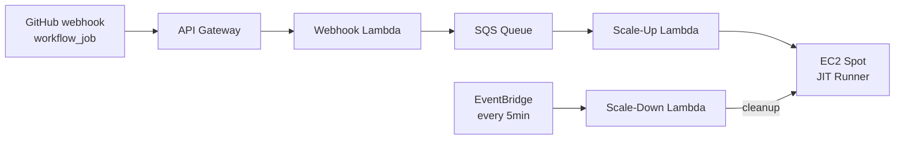

# jit-runners

On-demand GitHub Actions self-hosted runners using AWS Lambda (Go) + EC2 spot instances. Listens for `workflow_job` webhooks, launches ephemeral JIT runners on EC2 spot, and auto-cleans up after job completion.

**Language**: Go. See `lambda/go.mod` for the current version.

---

## Mandatory Rules

These rules always apply — do not skip them under any circumstances.

### DCO Sign-off

Every commit **must** be signed off with `git commit -s`. The DCO bot is enabled; PRs with unsigned commits will fail.

- If you committed without sign-off: `git commit --amend -s --no-edit` then force-push.
- Never add `Made-with: Cursor` or similar trailers to commit messages.

Before every commit, verify `user.name` and `user.email` are set in git config (global or local):

```sh
git config user.name   # must return a non-empty value
git config user.email  # must return a non-empty value
```

If either is missing, resolve the values before committing:

1. Try to infer them from context — run `gh api user --jq '.name,.email'` to retrieve the authenticated GitHub user's name and email.
2. If the email is private or empty, try `gh api user/emails --jq '.[].email'` and pick the primary address.
3. If the values still cannot be determined, **ask the user** what `user.name` and `user.email` should be — do not use placeholder values.

Once resolved:

```sh
git config user.name "<resolved name>"
git config user.email "<resolved email>"
```

### Documentation After Changes

After any change that affects behavior, config, IaC, or CI, delegate documentation updates to the **documentation-maintainer** agent.

**Within a Claude Code session:** Use the Agent tool with `subagent_type: "documentation-maintainer"` and describe what changed in the prompt.

**From terminal:**

```bash
claude --agent documentation-maintainer "update docs for: <what changed>"
```

The agent runs the full checklist: README, docs/, infra/, AGENTS.md, CLAUDE.md, .claude/commands, .claude/skills. Do not skip this step.

### Issue Creation Validation

When creating GitHub issues via `/feature` or `/bug`, validate the draft with the **issue-reviewer** agent before calling `gh issue create`. Do not upload until the draft is approved or refined.

---

## Architecture



Three Lambda functions share code via `lambda/internal/`:

- **webhook**: Validates signature, parses event, enqueues to SQS
- **scaleup**: Launches EC2 spot, generates JIT runner config, tracks state in DynamoDB
- **scaledown**: Cleans up stale/orphaned instances on a schedule

## Go Standards

Applies to all `**/*.go` files:

- **Format**: `gofmt -s`. Run `make check-fmt` before committing.
- **Lint**: Conform to `.golangci.yml`. Do not introduce new violations.
- **Packages**: Code in `lambda/internal/` must not be imported from outside this module.
- **Errors**: Wrap errors with context: `fmt.Errorf("context: %w", err)`. Never silently ignore errors.
- **Exports**: Public functions and types must have doc comments starting with the identifier name.
- **Tests**: Place `*_test.go` in the same package as the code. Use table-driven tests.
- **Interfaces**: Define interfaces for AWS service clients to enable testing with mocks.

## Project Layout

```text
lambda/                     # Separate Go module for Lambda functions
  cmd/{webhook,scaleup,scaledown}/main.go   # Entry points
  internal/
    config/                 # Env + Secrets Manager config
    github/                 # Webhook verify, JWT auth, JIT runner API
    webhook/                # workflow_job event parsing
    ec2/                    # Spot instance launch + user-data (incl. pre-baked AMI detection)
    sqs/                    # SQS publish/consume
    runner/                 # DynamoDB state + cleanup
infra/
  terraform/                # OpenTofu/Terraform IaC (HCL)
  cloudformation/           # AWS CloudFormation template (YAML)
  packer/                   # Packer template for pre-baked runner AMI (AL2023)
    jit-runner.pkr.hcl      # amazon-ebs source; associate_public_ip_address conditional on subnet_id + ssh_timeout=10m; community AMI catalog publishing controlled by ami_groups; validation provisioner checks all critical tools including docker compose and docker buildx
    variables.pkr.hcl       # runner_version, jit_runners_version, aws_region, ami_regions, ami_distribution_regions, ami_groups, instance_type, extra_script, ami_name_prefix, subnet_id, go_version, node_major_version, volume_size
    scripts/
      setup-runner.sh       # Orchestrator: calls 01–07 sub-scripts in order
      01-system-base.sh     # System libs and Development Tools (gcc, g++, cmake)
      02-docker.sh          # Docker 25.x, Compose v2, Buildx
      03-languages.sh       # Python 3, Node.js LTS, Go
      04-cloud-tools.sh     # AWS CLI v2, kubectl, Helm 3
      05-cli-tools.sh       # gh, jq, yq, git-lfs, yamllint, zip, etc.
      06-runner-agent.sh    # runner user, runner agent, marker file, manifest
      07-cleanup.sh         # DNF cache, temp files; writes prebaked marker + manifest
docs/                       # Deployment guides and setup instructions
```

## Build & Test

```bash
make lambda.build        # Build all three Lambda binaries
make lambda.test         # Run tests with coverage
make lint                # Run golangci-lint
make check               # All checks (lint + vet + test)

make ami.validate        # Validate Packer template
make ami.build           # Build pre-baked runner AMI in us-east-2 (public, version from git)
make ami.build-test      # Build private (non-public) test AMI in us-east-2
make ami.build-distribute  # Build AMI and copy to all distribution regions (US, EU, SA)
make ami.copy AMI_ID=ami-xxx  # Copy an existing AMI to all distribution regions
```

## IaC

Infrastructure lives in `infra/` with three components:

- **Terraform/OpenTofu**: `infra/terraform/` — deploy with `cd infra/terraform && tofu init && tofu plan && tofu apply`
- **CloudFormation**: `infra/cloudformation/template.yaml` — deploy with `aws cloudformation deploy`
- **Packer**: `infra/packer/` — build a pre-baked AL2023 AMI with `make ami.build` or `make ami.build-distribute`

See `docs/getting-started-terraform.md` and `docs/getting-started-cloudformation.md` for step-by-step guides.

## CI and Release

Applies to `.github/**/*.yml`, `Makefile`, `.goreleaser.yml`:

- **Semver**: Tags use `vMAJOR.MINOR.PATCH` (e.g. `v0.1.0`). The `v` prefix is required.
- **Release**: Push a tag → CI runs `release.yml` → GoReleaser creates GitHub Release with 3 Lambda zip archives (webhook.zip, scaleup.zip, scaledown.zip), raw binaries, checksums, and release notes.
- **Release notes**: Generated by GitHub (github-native) and categorized by `.github/release.yml` + PR labels. For breaking changes to appear under "Breaking Changes", apply the `breaking-change` label before merge.
- **Branch naming for labels**: `feat/...` → feature, `fix/...` → bug, `enhance/...` → enhancement, `ci/...` → github-actions, `(deps)/...` → dependencies, branch with `!` → breaking-change.
- **AMI build CI**: `.github/workflows/ami-build.yml` — workflow_dispatch (inputs: `runner_version`, `go_version`, `node_major_version`, `jit_runners_version`, `extra_script`, `distribute`), auto-trigger on version tag push (`v*`), and pull_request trigger for `infra/packer/**` changes. PR builds create private (`ami_groups=[]`), single-region AMIs with the `jit-runner-pr` prefix and auto-clean up the AMI and snapshots after the build. The `jit_runners_version` is auto-detected via `git describe --tags --always` (falls back to `dev`) if not provided. Uses OIDC role assumption via `AMI_BUILD_ROLE_ARN` secret. Distribute copies AMI to US, EU, and SA regions. **Runs on GitHub-hosted runners (`ubuntu-latest`)**, not self-hosted — the self-hosted runner security group only permits egress on ports 443/80/53, which blocks the SSH connection (port 22) that Packer requires to reach the build instance; this also avoids the circular dependency of building jit-runner AMIs on the jit-runners infrastructure itself.
- Keep path filters and job dependencies intact in CI workflows. Do not remove or override Renovate config in `.github/renovate.json5`.

## Agents, Commands, and Skills

Available in `.claude/`:

| Type | Name | Purpose |
| ---- | ---- | ------- |
| Agent | `documentation-maintainer` | Runs full doc checklist after code/IaC/CI changes |
| Agent | `issue-reviewer` | Triages open issues; validates drafts before upload |
| Agent | `issue-writer` | Creates GitHub issues from `/feature` and `/bug` commands |
| Agent | `pr-reviewer` | Reviews PRs via `gh` CLI — DCO, Go style, tests, IaC, docs |
| Command | `/bug` | Create a bug report (invokes issue-writer) |
| Command | `/feature` | Create a feature request (invokes issue-writer) |
| Skill | `maintain-documentation` | Delegates doc updates to documentation-maintainer agent |
| Skill | `open-pull-request` | Commits and opens a PR via `gh` with DCO sign-off |
| Skill | `release-and-versioning` | Cuts a semver release with GoReleaser |
| Skill | `testing-and-ci` | Runs tests, lint, format checks; explains CI |
