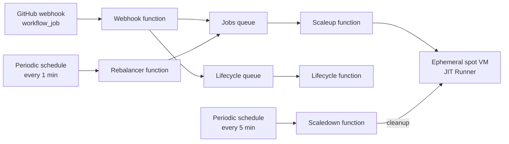

# jit-runners

On-demand GitHub Actions self-hosted runners deployable on AWS or GCP using Go-based serverless functions and ephemeral spot VMs. Listens for `workflow_job` webhooks, launches JIT runners on EC2 spot or GCE spot, and auto-cleans up after job completion.

**Language**: Go. See `lambda/go.mod` for the current version.

---

## Mandatory Rules

These rules always apply — do not skip them under any circumstances.

### DCO Sign-off

Every commit **must** be signed off with `git commit -s`. The DCO bot is enabled; PRs with unsigned commits will fail.

- If you committed without sign-off: `git commit --amend -s --no-edit` then force-push.
- Never add `Made-with: Cursor` or similar trailers to commit messages.

Before every commit, verify `user.name` and `user.email` are set in git config (global or local):

```sh
git config user.name   # must return a non-empty value
git config user.email  # must return a non-empty value
```

If either is missing, resolve the values before committing:

1. Try to infer them from context — run `gh api user --jq '.name,.email'` to retrieve the authenticated GitHub user's name and email.
2. If the email is private or empty, try `gh api user/emails --jq '.[].email'` and pick the primary address.
3. If the values still cannot be determined, **ask the user** what `user.name` and `user.email` should be — do not use placeholder values.

Once resolved:

```sh
git config user.name "<resolved name>"
git config user.email "<resolved email>"
```

### Documentation After Changes

After any change that affects behavior, config, IaC, or CI, delegate documentation updates to the **documentation-maintainer** agent.

**Within a Claude Code session:** Use the Agent tool with `subagent_type: "documentation-maintainer"` and describe what changed in the prompt.

**From terminal:**

```bash
claude --agent documentation-maintainer "update docs for: <what changed>"
```

The agent runs the full checklist: README, docs/, infra/, AGENTS.md, CLAUDE.md, .claude/commands, .claude/skills. Do not skip this step.

### Issue Creation Validation

When creating GitHub issues via `/feature` or `/bug`, validate the draft with the **issue-reviewer** agent before calling `gh issue create`. Do not upload until the draft is approved or refined.

---

## Architecture


```mermaid
graph LR
    A[GitHub webhook<br>workflow_job] --> B[Webhook function]
    B --> C[Jobs queue]
    C --> D[Scaleup function]
    D --> E[Ephemeral spot VM<br>JIT Runner]
    B --> F[Lifecycle queue]
    F --> G[Lifecycle function]
    H[Periodic schedule<br>every 5 min] --> I[Scaledown function]
    J[Periodic schedule<br>every 1 min] --> K[Rebalancer function]
    K --> C
    I -->|cleanup| E
```

Five serverless functions share code via `lambda/internal/`. The control plane runs on AWS Lambda OR GCP Cloud Run functions Gen 2; the runner VMs are EC2 spot (AWS) or GCE spot (GCP).

- **webhook**: Validates the GitHub webhook signature, parses the `workflow_job` event, and routes to the jobs queue (`queued` action) or the lifecycle queue (`in_progress` / `completed` action).
- **scaleup**: Consumes jobs-queue messages, generates a JIT runner token, and launches an EC2 spot or GCE spot VM. On AWS, tries multiple candidate instance types × subnets (AZs) for spot (first-success-wins) before falling back to on-demand; emits `event=spot_exhausted_ondemand_fallback` on fallback. Tracks state in DynamoDB (AWS) or Firestore Native (GCP).
- **scaledown**: Cleans up stale/orphaned instances on a periodic schedule (every 5 minutes); re-enqueues stuck pending runners.
- **lifecycle**: Consumes lifecycle-queue messages, applies state transitions, deregisters runners.
- **rebalancer**: Runs every 1 minute to detect drift between GitHub queue depth and the state store's pending count, re-publishing jobs-queue messages to recover stranded queued jobs.

The cloud-agnostic interfaces (`internal/queue/`, `internal/state/`, `internal/compute/`, `internal/secrets/`) plus the `internal/provider/` factory dispatching on `CLOUD_PROVIDER` env var let the same five entry points run on either cloud.

### Service mapping

| Component | AWS | GCP |
| --- | --- | --- |
| Webhook ingress | API Gateway HTTP | Cloud Run function HTTPS URL |
| Functions runtime | Lambda (`provided.al2023`) | Cloud Run functions Gen 2 (`go122`) |
| Job queue | SQS + EventBridge schedule | Pub/Sub + Eventarc + Cloud Scheduler |
| State store | DynamoDB on-demand | Firestore Native + TTL |
| Secrets | AWS Secrets Manager | Secret Manager |
| Runner VM | EC2 spot | GCE spot |
| Runner image | Pre-baked AMI (Packer `amazon-ebs`) | Pre-baked GCE image (Packer `googlecompute`) |

## Go Standards

Applies to all `**/*.go` files:

- **Format**: `gofmt -s`. Run `make check-fmt` before committing.
- **Lint**: Conform to `.golangci.yml`. Do not introduce new violations.
- **Packages**: Code in `lambda/internal/` must not be imported from outside this module.
- **Errors**: Wrap errors with context: `fmt.Errorf("context: %w", err)`. Never silently ignore errors.
- **Exports**: Public functions and types must have doc comments starting with the identifier name.
- **Tests**: Place `*_test.go` in the same package as the code. Use table-driven tests.
- **Interfaces**: Define interfaces for cloud service clients (AWS: EC2/SQS/DynamoDB/SecretsManager; GCP: Compute/PubSub/Firestore/SecretManager) to enable testing with mocks. The cloud-agnostic abstractions live in `internal/queue|state|compute|secrets/` and the per-cloud impls in `internal/aws/` and `internal/gcp/`.

## Project Layout

```text
lambda/                     # Go module for the five serverless functions
  cmd/{webhook,scaleup,scaledown,lifecycle,rebalancer}/main.go   # Entry points (5 binaries)
  internal/
    config/                 # Env + cloud-secret-manager config loading
    github/                 # Webhook verify, JWT auth, JIT runner API (cloud-agnostic)
    webhook/                # workflow_job event parsing + routing dispatch
    queue/                  # Cloud-agnostic queue interface (PublishScaleUp, ParseScaleUp, PublishLifecycle, ParseLifecycle)
    state/                  # Cloud-agnostic runner state store interface (RunnerStore)
    compute/                # Cloud-agnostic VM launcher interface
    secrets/                # Cloud-agnostic secrets loader interface
    provider/               # Bundle factory: provider.New(ctx, name) dispatches on CLOUD_PROVIDER
    aws/{sqs,dynamo,ec2,secretsmanager}/   # AWS impls
    gcp/{pubsub,firestore,gce,secretmanager,runtime}/   # GCP impls + CloudEvents HTTP shim
    runner/                 # Cleanup logic (cloud-agnostic)
    lifecycle/              # Lifecycle event handler (cloud-agnostic)
    rebalancer/             # Drift recovery cycle (cloud-agnostic)
infra/
  terraform/                # AWS OpenTofu/Terraform (HCL)
  cloudformation/           # AWS CloudFormation template (YAML)
  terraform-gcp/            # GCP OpenTofu/Terraform (HCL) — operators set var.release_tag and the module fetches function source declaratively from the matching GitHub Release
  packer/                   # Shared Packer template — amazon-ebs + googlecompute sources
    jit-runner.pkr.hcl      # Both sources; shared post-processors and provisioners
    variables.pkr.hcl       # Shared + AWS-specific + GCP-specific variables
    scripts/aws/            # Amazon Linux 2023 provisioning scripts
    scripts/gcp/            # Ubuntu 24.04 LTS provisioning scripts
docs/                       # Deployment guides and operational docs
  getting-started-aws.md    # AWS path: OpenTofu/Terraform OR CloudFormation
  getting-started-gcp.md    # GCP path: OpenTofu/Terraform
  github-app-setup.md       # Cloud-agnostic GitHub App + secrets setup
  release.md                # Production rollout flow (AWS + GCP sections)
  troubleshooting.md        # Operational issues + diagnosis (AWS + GCP-specific sections)
  ami-prebaked.md           # Packer pipeline reference
```

## Build & Test

```bash
make lambda.build        # Build all five function binaries (webhook, scaleup, scaledown, lifecycle, rebalancer)
make lambda.test         # Run tests with coverage
make lint                # Run golangci-lint
make check               # All checks (lint + vet + test)

# AWS — Pre-baked AMI build (Packer, amazon-ebs source)
make ami.validate
make ami.build                                # private AMI in us-east-2 (version from git)
make ami.build-test                           # private test AMI in us-east-2 (jit-runner-pr prefix)

# GCP — Pre-baked GCE image build (Packer, googlecompute source — same template, parallel scripts)
make image.validate
make image.build GCP_PROJECT=my-project       # public GCE image
make image.build-test GCP_PROJECT=my-project  # private test GCE image
make image.build-distribute GCP_PROJECT=my-project   # public + multi-region storage replication
```

## IaC

Infrastructure lives in `infra/`:

- **AWS — OpenTofu/Terraform**: `infra/terraform/` — deploy with `cd infra/terraform && tofu init && tofu plan && tofu apply`.
- **AWS — CloudFormation**: `infra/cloudformation/template.yaml` — deploy with `aws cloudformation deploy`.
- **GCP — OpenTofu/Terraform**: `infra/terraform-gcp/` — `cd infra/terraform-gcp && tofu init && tofu plan && tofu apply`. Operators set `var.release_tag` and the module fetches function source from the matching GitHub Release declaratively (no manual `gsutil cp` step).
- **Packer**: `infra/packer/` — same template, two sources. Build an AWS AMI with `make ami.build`, a GCP GCE image with `make image.build GCP_PROJECT=my-project`.

See `docs/getting-started-aws.md` and `docs/getting-started-gcp.md` for step-by-step deployment guides. See `docs/troubleshooting.md` for common operational issues and diagnosis commands (with both AWS and GCP-specific sections).

## CI and Release

Applies to `.github/**/*.yml`, `Makefile`, `.goreleaser.yml`:

- **Semver**: Tags use `vMAJOR.MINOR.PATCH` (e.g. `v0.1.0`). The `v` prefix is required.
- **Release**: Push a tag → CI runs `release.yml` → GoReleaser creates a GitHub Release with five function zip archives (`webhook.zip`, `scaleup.zip`, `scaledown.zip`, `lifecycle.zip`, `rebalancer.zip`), raw binaries, checksums, and release notes. The GCP Terraform module fetches these zips declaratively from the release matching `var.release_tag`.
- **Release notes**: Generated by GitHub (github-native) and categorized by `.github/release.yml` + PR labels. For breaking changes to appear under "Breaking Changes", apply the `breaking-change` label before merge.
- **Branch naming for labels**: `feat/...` → feature, `fix/...` → bug, `enhance/...` → enhancement, `ci/...` → github-actions, `(deps)/...` → dependencies, branch with `!` → breaking-change.
- **AMI build CI**: `.github/workflows/ami-build.yml` — workflow_dispatch (inputs: `runner_version`, `go_version`, `node_major_version`, `jit_runners_version`, `extra_script`), auto-trigger on version tag push (`v*`), and pull_request trigger for `infra/packer/**` changes. All non-PR builds produce a **private** AMI in `us-east-2` only (`ami_groups=[]` by default — no public sharing, no multi-region copy). PR builds use the `jit-runner-pr` name prefix and auto-clean up the AMI and snapshots after the build. The `jit_runners_version` is auto-detected via `git describe --tags --always` (falls back to `dev`) if not provided. Uses OIDC role assumption via `AMI_BUILD_ROLE_ARN` secret. Older AMIs are pruned to the latest 2 by a post-build job (see docs/ami-prebaked.md). **Runs on GitHub-hosted runners (`ubuntu-latest`)**, not self-hosted — the self-hosted runner security group only permits egress on ports 443/80/53, which blocks the SSH connection (port 22) that Packer requires to reach the build instance; this also avoids the circular dependency of building jit-runner AMIs on the jit-runners infrastructure itself.
- **GCE image build CI**: `.github/workflows/gce-image-build.yml` — workflow_dispatch, auto-trigger on version tag push, and pull_request trigger for `infra/packer/**` changes. PR builds use the `jit-runner-pr` prefix and auto-clean up after the workflow. Uses Workload Identity Federation via `GCE_BUILD_WIF_PROVIDER` + `GCE_BUILD_SA_EMAIL` repo secrets (set up out-of-band in the maintainer's personal GCP project per spec D14).
- Keep path filters and job dependencies intact in CI workflows. Do not remove or override Renovate config in `.github/renovate.json5`.

## Agents, Commands, and Skills

Agents are managed centrally in the [code-agent-hub](https://github.com/devopsfactory-io/code-agent-hub) at `.claude/agents/<role>/AGENTS.md`, each loading project-specific context from `.claude/skills/jit-runners/<role>/SKILL.md`. Commands and skills remain local in `.claude/`:

| Type | Name | Purpose | Location |
| ---- | ---- | ------- | -------- |
| Agent | `documentation-maintainer` | Runs full doc checklist after code/IaC/CI changes | hub |
| Agent | `em` | Engineering Manager — coordinates jit-runners team | hub |
| Agent | `go-developer` | Go implementation for jit-runners Lambda | hub |
| Agent | `iac-developer` | IaC modules and GitHub Actions | hub |
| Agent | `issue-reviewer` | Triages open issues; validates drafts before upload | hub |
| Agent | `issue-writer` | Creates GitHub issues from `/feature` and `/bug` commands | hub |
| Agent | `platform-engineering` | GitOps, CI/CD, observability | hub |
| Agent | `pr-reviewer` | Reviews PRs via `gh` CLI — DCO, Go style, tests, docs | hub |
| Agent | `qa` | Code quality and test coverage | hub |
| Agent | `security` | Security scanning for code and IaC | hub |
| Command | `/bug` | Create a bug report (invokes issue-writer) |
| Command | `/feature` | Create a feature request (invokes issue-writer) |
| Skill | `maintain-documentation` | Delegates doc updates to documentation-maintainer agent |
| Skill | `open-pull-request` | Commits and opens a PR via `gh` with DCO sign-off |
| Skill | `release-and-versioning` | Cuts a semver release with GoReleaser |
| Skill | `testing-and-ci` | Runs tests, lint, format checks; explains CI |
