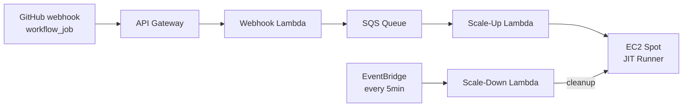

# Just in Time Runners ⚡

<p align="center">
  <a href="https://github.com/devopsfactory-io/jit-runners/releases"></a>
  <a href="https://pkg.go.dev/github.com/devopsfactory-io/jit-runners"></a>
  <a href="https://goreportcard.com/report/github.com/devopsfactory-io/jit-runners"></a>
  <a href="https://github.com/devopsfactory-io/jit-runners/actions?query=branch%3Amain"></a>
</p>

<p align="center">
  
</p>

<p align="center">
  <b>On-demand GitHub Actions self-hosted runners using AWS Lambda (Go) + EC2 spot instances</b>
</p>

- [Just in Time Runners ⚡](#just-in-time-runners-)
  - [Resources](#resources)
  - [What is jit-runners?](#what-is-jit-runners)
  - [How does it work?](#how-does-it-work)
  - [Why use it?](#why-use-it)
  - [Pre-baked AMI](#pre-baked-ami)
  - [Quick Start](#quick-start)

## Resources

- **Documentation**: [docs/](docs/) - Configuration, deployment, and development guides.
- **Releases**: [github.com/devopsfactory-io/jit-runners/releases](https://github.com/devopsfactory-io/jit-runners/releases)
- **Infrastructure (OpenTofu/Terraform)**: [infra/terraform/](infra/terraform/) - HCL modules for all AWS resources.
- **Infrastructure (CloudFormation)**: [infra/cloudformation/](infra/cloudformation/) - CloudFormation template (`template.yaml`).
- **Infrastructure (Packer)**: [infra/packer/](infra/packer/) - Packer template for pre-baked runner AMI.
- **Getting started (Terraform)**: [docs/getting-started-terraform.md](docs/getting-started-terraform.md)
- **Getting started (CloudFormation)**: [docs/getting-started-cloudformation.md](docs/getting-started-cloudformation.md)
- **GitHub App setup**: [docs/github-app-setup.md](docs/github-app-setup.md) - Create and configure the GitHub App that sends `workflow_job` webhooks.
- **Contributing**: [CLAUDE.md](CLAUDE.md) for AI and contributor guidance.

## What is jit-runners?

jit-runners provisions on-demand GitHub Actions self-hosted runners that launch EC2 spot instances as ephemeral JIT (Just-In-Time) runners. Three AWS Lambda functions written in Go handle webhook reception, instance provisioning, and cleanup. There are no long-running servers — the entire control plane runs on serverless infrastructure.



The three Lambda functions share code via `lambda/internal/`:

- **webhook** - Validates the GitHub webhook signature, parses the `workflow_job` event, and enqueues a message to SQS.
- **scaleup** - Processes SQS messages, generates a JIT runner token via the GitHub API, and launches an EC2 spot instance with a user-data script that registers and runs the ephemeral runner.
- **scaledown** - Runs on a schedule to clean up stale or orphaned instances and deregisters any runners that have not self-terminated.

## How does it work?

1. A GitHub App sends `workflow_job` webhooks to an API Gateway endpoint when a workflow job is queued.
2. The Webhook Lambda validates the HMAC signature, parses the event, and enqueues a message to SQS with a 30-second delivery delay — this provides a deduplication window to absorb duplicate webhook deliveries before an instance is launched.
3. The Scale-Up Lambda processes the SQS message, calls the GitHub API to generate a JIT runner registration token, and launches an EC2 spot instance (falling back to on-demand automatically if spot capacity is unavailable). The instance user-data script configures the runner agent (installing it on stock AMIs, or reusing the pre-baked binary on pre-baked AMIs), registers it using the JIT config, and immediately starts accepting jobs.
4. After the job completes, the runner agent self-deregisters from GitHub and the instance self-terminates — no manual cleanup needed.
5. The Scale-Down Lambda fires every 5 minutes via an EventBridge Scheduler. It queries DynamoDB for runner state and terminates any instances that are stale, orphaned, or whose runners have already deregistered.

## Why use it?

- **Up to 90% cost savings** - EC2 spot instances cost a fraction of GitHub-hosted runners for equivalent compute.
- **No idle infrastructure** - Runners launch on demand and terminate after use; you pay only for the seconds a job is running.
- **Private network access** - Runners launch inside your VPC and can reach private resources (RDS, EKS API, internal registries) that GitHub-hosted runners cannot.
- **Custom hardware** - Configure instance types and sizes per workflow label (e.g. `runs-on: [self-hosted, c6i.4xlarge]`). The default instance type when no label matches is `t3.large`.
- **Single-use ephemeral runners** - Each job gets a clean environment with no shared state, no credential leakage, and no leftover artifacts from previous runs.
- **Serverless control plane** - No servers to maintain or patch. The entire orchestration layer is Lambda, SQS, DynamoDB, and EventBridge.

## Pre-baked AMI

jit-runners ships a pre-baked Amazon Linux 2023 AMI with all GitHub Actions runner dependencies pre-installed. Using the pre-baked AMI eliminates the per-job dependency installation step, reducing cold-start time.

The AMI is built with [Packer](https://www.packer.io/) from `infra/packer/`. It:

- Installs runner system libraries and CI toolchain (`libicu`, `lttng-ust`, `openssl-libs`, `krb5-libs`, `zlib`, `git`, `make`, `tar`, `gzip`, `unzip`).
- Creates a dedicated `runner` OS user.
- Downloads the GitHub Actions runner agent to `/home/runner/actions-runner/`.
- Writes a version marker at `/opt/jit-runner-prebaked`.

At instance launch, the user-data script checks for `/opt/jit-runner-prebaked`. If the file exists and the version matches the requested runner version, dependency installation and user creation are skipped. If the version differs, only the runner binary is re-downloaded. Stock AMIs (no marker file) still work as before.

The AMI is published publicly to the AWS Community AMI catalog (`ami_groups = ["all"]`) with name pattern `jit-runner-<version>-<timestamp>`. It can be distributed to multiple regions: `us-east-1`, `us-west-1`, `us-west-2`, `eu-west-1`, `eu-west-2`, `eu-west-3`, `eu-central-1`, `eu-north-1`, `sa-east-1`.

### Building the AMI

```bash
# Validate Packer template
make ami.validate

# Build AMI in us-east-2 only
make ami.build

# Build and copy to all distribution regions (US, EU, SA)
make ami.build-distribute

# Copy an existing AMI to all distribution regions
make ami.copy AMI_ID=ami-xxxxxxxx
```

You can also trigger an AMI build from GitHub Actions via the `ami-build.yml` workflow (workflow_dispatch). Inputs: `runner_version`, `extra_script`, `distribute`. The workflow uses OIDC (`AMI_BUILD_ROLE_ARN` secret) and auto-triggers on pushes to `infra/packer/**`.

## Quick Start

Choose the deployment path that matches your tooling:

- **OpenTofu / Terraform**: Follow [docs/getting-started-terraform.md](docs/getting-started-terraform.md) to deploy the full AWS stack with HCL modules in [infra/terraform/](infra/terraform/).
- **CloudFormation**: Follow [docs/getting-started-cloudformation.md](docs/getting-started-cloudformation.md) to deploy using the SAM/CloudFormation template in [infra/cloudformation/template.yaml](infra/cloudformation/template.yaml).

Both guides assume a GitHub App is already configured. If you have not set one up yet, start with [docs/github-app-setup.md](docs/github-app-setup.md).
