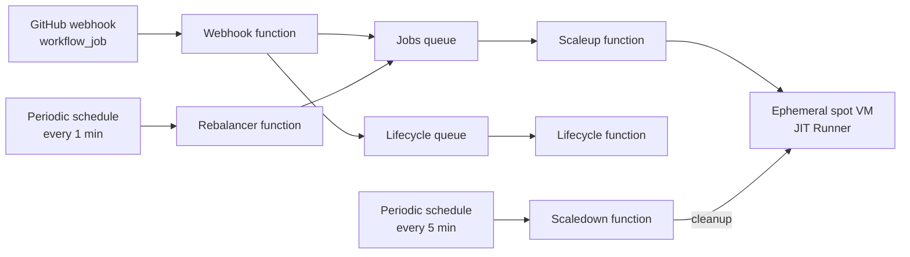

# Just in Time Runners ⚡

<p align="center">
  <a href="https://github.com/devopsfactory-io/jit-runners/releases"></a>
  <a href="https://pkg.go.dev/github.com/devopsfactory-io/jit-runners/lambda"></a>
  <a href="https://goreportcard.com/report/github.com/devopsfactory-io/jit-runners/lambda"></a>
  <a href="https://github.com/devopsfactory-io/jit-runners/actions?query=branch%3Amain"></a>
</p>

<p align="center">
  
</p>

<p align="center">
  <b>On-demand GitHub Actions self-hosted runners on AWS or GCP</b>
</p>

- [Just in Time Runners ⚡](#just-in-time-runners-)
  - [Resources](#resources)
  - [What is jit-runners?](#what-is-jit-runners)
  - [How does it work?](#how-does-it-work)
  - [Why use it?](#why-use-it)
  - [Pre-baked images](#pre-baked-images)
  - [Quick Start](#quick-start)

## Resources

- **Documentation**: [docs/](docs/) — Configuration, deployment, and development guides.
- **Releases**: [github.com/devopsfactory-io/jit-runners/releases](https://github.com/devopsfactory-io/jit-runners/releases)
- **Deploy on AWS**: [docs/getting-started-aws.md](docs/getting-started-aws.md) — OpenTofu/Terraform or CloudFormation.
- **Deploy on GCP**: [docs/getting-started-gcp.md](docs/getting-started-gcp.md) — OpenTofu/Terraform.
- **GitHub App setup**: [docs/github-app-setup.md](docs/github-app-setup.md) — Create and configure the GitHub App that sends `workflow_job` webhooks (cloud-agnostic).
- **Troubleshooting**: [docs/troubleshooting.md](docs/troubleshooting.md) — Common operational issues, diagnosis commands, and resolutions.
- **Release procedure**: [docs/release.md](docs/release.md) — Production rollout flow.
- **Contributing**: [CLAUDE.md](CLAUDE.md) for AI and contributor guidance.

## What is jit-runners?

jit-runners provisions on-demand GitHub Actions self-hosted runners by launching ephemeral spot VMs as JIT (Just-In-Time) runners. Five short-running serverless functions handle webhook reception, instance provisioning, lifecycle tracking, periodic cleanup, and drift recovery. There are no long-running servers — the entire control plane runs on serverless infrastructure (AWS Lambda or GCP Cloud Run functions).


```mermaid
graph LR
    A[GitHub webhook<br>workflow_job] --> B[Webhook function]
    B --> C[Jobs queue]
    C --> D[Scaleup function]
    D --> E[Ephemeral spot VM<br>JIT Runner]
    B --> F[Lifecycle queue]
    F --> G[Lifecycle function]
    H[Periodic schedule<br>every 5 min] --> I[Scaledown function]
    J[Periodic schedule<br>every 1 min] --> K[Rebalancer function]
    K --> C
    I -->|cleanup| E
```

**Service mapping:**

| Component | AWS service | GCP service |
| --- | --- | --- |
| Webhook ingress | API Gateway HTTP | Cloud Run function HTTPS URL |
| Functions runtime | Lambda (`provided.al2023`) | Cloud Run functions Gen 2 (`go122`) |
| Job queue | SQS + EventBridge schedule | Pub/Sub + Eventarc + Cloud Scheduler |
| Runner state store | DynamoDB on-demand | Firestore Native + TTL |
| Secrets | AWS Secrets Manager | Secret Manager |
| Runner VM | EC2 spot (`provisioning_model: spot`) | GCE spot (`provisioningModel: SPOT`) |
| Runner image | Pre-baked AMI (Packer `amazon-ebs`) | Pre-baked GCE image (Packer `googlecompute`) |

The five serverless functions share code via `lambda/internal/`:

- **webhook** — Validates the GitHub webhook signature, parses the `workflow_job` event, and routes the event to the jobs queue (action=queued) or the lifecycle queue (action=in_progress | completed).
- **scaleup** — Processes jobs-queue messages, generates a JIT runner token via the GitHub API, and launches an EC2 spot or GCE spot VM with a startup script that registers and runs the ephemeral runner.
- **scaledown** — Runs on a periodic schedule (every 5 minutes) to clean up stale or orphaned instances, deregister abandoned runners, and re-enqueue jobs whose pending runners got stuck.
- **lifecycle** — Processes lifecycle-queue messages (`workflow_job` action=in_progress | completed) and applies state transitions and runner deregistration.
- **rebalancer** — Runs on a tighter schedule (every 1 minute) to detect drift between GitHub queue depth and DDB/Firestore pending count, re-publishing jobs-queue messages for any gap. Closes the stranded-queued-jobs cycle in production.

## How does it work?

1. A GitHub App sends `workflow_job` webhooks to the webhook function's HTTPS endpoint when a workflow job is queued.
2. The Webhook function validates the HMAC signature, parses the event, and publishes a message to the jobs queue (for `queued` events) or the lifecycle queue (for `in_progress` / `completed` events).
3. The Scaleup function processes a jobs-queue message, calls the GitHub API to generate a JIT runner registration token, and launches a spot VM. The instance startup script configures the runner agent (installing it on stock images, or reusing the pre-baked binary on pre-baked images), registers using the JIT config, and immediately starts accepting jobs.
4. After the job completes, the runner agent self-deregisters from GitHub and the instance self-terminates — no manual cleanup needed. The Lifecycle function processes the in_progress/completed events to keep the state store accurate.
5. The Scaledown function fires every 5 minutes via a cloud-native schedule (EventBridge on AWS, Cloud Scheduler on GCP). It queries the state store and terminates any instances that are stale, orphaned, or whose runners have already deregistered, and re-enqueues stuck pending jobs.
6. The Rebalancer function fires every 1 minute to detect drift between GitHub queue depth and the state store's pending runner count, re-publishing jobs-queue messages to recover any stranded queued jobs.

## Why use it?

- **Up to 90% cost savings** — Spot instances cost a fraction of GitHub-hosted runners for equivalent compute.
- **No idle infrastructure** — Runners launch on demand and terminate after use; you pay only for the seconds a job is running.
- **Private network access** — Runners launch inside your VPC and can reach private resources (databases, internal registries, Kubernetes API endpoints) that GitHub-hosted runners cannot.
- **Custom hardware** — Configure instance/machine types per workflow label (e.g. `runs-on: [self-hosted, c6i.4xlarge]`).
- **Single-use ephemeral runners** — Each job gets a clean environment with no shared state, no credential leakage, and no leftover artifacts from previous runs.
- **Serverless control plane** — No servers to maintain or patch. The entire orchestration layer is serverless functions + a queue + a state store.
- **Multi-cloud** — Pick AWS or GCP for the deployment that matches your existing tooling.

## Pre-baked images

jit-runners ships a pre-baked image with an ubuntu-latest-like toolchain pre-installed. Using the pre-baked image eliminates the per-job dependency installation step, reducing cold-start time.

- **AWS**: Amazon Linux 2023-based AMI built with Packer (`infra/packer/jit-runner.pkr.hcl`, `amazon-ebs` source). Built as a **private** AMI in `us-east-2` only — this project is single-tenant, so public distribution was dropped to eliminate EBS-snapshot cost and Packer complexity.
- **GCP**: Ubuntu 24.04 LTS-based GCE image built with the same Packer template (`googlecompute` source) and parallel provisioning scripts under `infra/packer/scripts/gcp/`. Published as a public image in the maintainer's personal GCP project; multi-region storage replication.

The image installs system libraries, build tools, Docker + Compose v2 + Buildx, Python 3, Node.js LTS, Go, cloud CLIs (`aws` or `gcloud`), `kubectl`, Helm 3, `gh`, `jq`, `yq`, `git-lfs`, `yamllint`, plus a runner OS user with the GitHub Actions runner agent pre-downloaded.

At instance launch, the startup script checks for a pre-baked marker file. If the file exists and the runner version matches the requested version, dependency installation is skipped. If the version differs, only the runner binary is re-downloaded. Stock images (no marker) still work but pay a per-job install cost.

### Building images

```bash
# AWS
make ami.validate                          # Validate Packer template
make ami.build                             # Build private AMI in us-east-2
make ami.build-test                        # Build private test AMI (jit-runner-pr prefix)

# GCP
make image.validate                        # Validate Packer template (GCP source)
make image.build GCP_PROJECT=my-project    # Build public image (multi-region distribute via separate command)
make image.build-test GCP_PROJECT=my-project   # Build private test image
```

CI workflows build images on tag push:

- **AWS**: `.github/workflows/ami-build.yml` — OIDC auth via `AMI_BUILD_ROLE_ARN` repo secret.
- **GCP**: `.github/workflows/gce-image-build.yml` — OIDC auth via `GCE_BUILD_WIF_PROVIDER` + `GCE_BUILD_SA_EMAIL` repo secrets.

Both workflows also run on PR pushes to `infra/packer/**` (private single-region builds, auto-cleaned after the workflow).

## Quick Start

Choose the cloud and IaC tool that matches your existing toolchain:

- **AWS** (OpenTofu/Terraform OR CloudFormation): [docs/getting-started-aws.md](docs/getting-started-aws.md).
- **GCP** (OpenTofu/Terraform): [docs/getting-started-gcp.md](docs/getting-started-gcp.md).

Both guides assume a GitHub App is already configured. If you have not set one up yet, start with [docs/github-app-setup.md](docs/github-app-setup.md).
